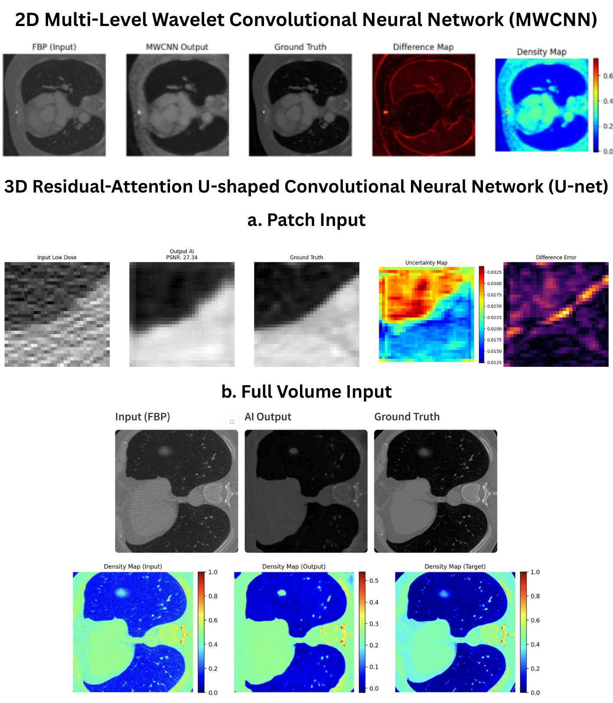

# Comparative Study of 2D and 3D Deep Learning for Low-Dose CT Denoising

## Project Overview
This project aims to enhance the image quality of **Low-Dose CT (LDCT)** scans, minimizing patient radiation exposure during lung cancer screening. We benchmarked **2D Multi-level Wavelet CNN (MWCNN)** against **3D Residual-Attention U-Net** to reconstruct high-fidelity images from noisy inputs.

**Dataset:** LoDoPaB-CT (Simulated Low-Dose from Normal-Dose CT).

## Methodology
We implemented and compared three reconstruction architectures:
1.  **Baseline:** Result from filtered back projection (FBP) - *Input Data*.
2.  **2D MWCNN:** Utilizes wavelet transform for efficient feature extraction and noise suppression.
3.  **3D Residual-Attention U-Net:** A volumetric approach with attention gates.

## Key Results
Our experiments revealed a significant trade-off between patch-based training accuracy and full-volume inference capability.

While the **3D model** performed well during patch-level testing, it suffered from domain shift issues when applied to full-volume patient scans because the model was trained on patch data. Consequently, the **2D MWCNN** turned out to be the robust solution.

| Metric | Input (FBP) | 2D MWCNN (Full Volume) | 3D Att-U-Net (Full Volume) | 3D Att-U-Net (Patch Test) |
| :--- | :--- | :--- | :--- | :--- |
| **PSNR (dB)** | 18.30 | 25.37 | 16.59 | 28.60 |
| **SSIM** | 0.26 | 0.64 | 0.68 | 0.8028 |
| **RMSE** | 0.12 | 0.05 | 0.14 | 0.03 |

> **Conclusion:** Although 3D Patch Testing shows high potential (PSNR 28.60), the **2D MWCNN** is selected as the best model for full-image reconstruction in this study.

## Visual Comparison
Below is the comparison between:
1.  **2D MWCNN Output** (Balanced noise reduction & detail)
2.  **3D Patch Output** (High quality, limited FOV)
3.  **3D Full Volume Output** (Artifact issues)

*Figure 1: Visual comparison showing that 2D MWCNN provides the most consistent full-image restoration, whereas 3D Full Volume suffers from reconstruction artifacts despite high patch-level scores.*

## Documentation (Full Report)
The comprehensive research report is available in Indonesian. It covers detailed mathematical derivations, architecture diagrams, and extensive testing data.

**[Download Full Report (Bahasa Indonesia)](Full_Report_Indonesian.pdf)**

## Code Implementation
You can view the full training and testing process in the Jupyter Notebook below:

**[View Code Notebook (.ipynb)](Python_Script.ipynb)**

## Tech Stack
* **Language:** Python
* **Deep Learning Framework:** PyTorch
* **Libraries:** NumPy, Matplotlib, Scikit-image, PyWavelets

## Contributors
* **Crystaly**
* **Mutiara Putri Afrita**
* **Raisa Shahira Afnan**
* **Athallah Fadhil**

---
*This project was conducted as a Final Project for the Medical Imaging Technology Course at Biomedical Engineering Study Program, Department of Electrical Engineering, Universitas Indonesia.*
